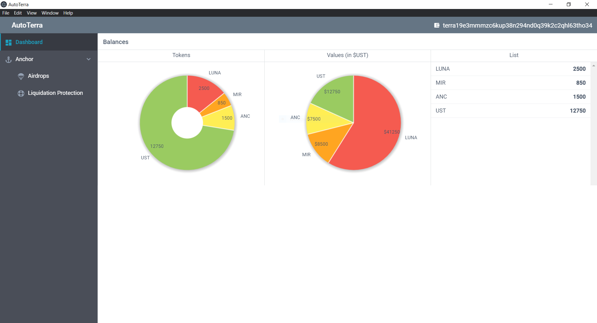
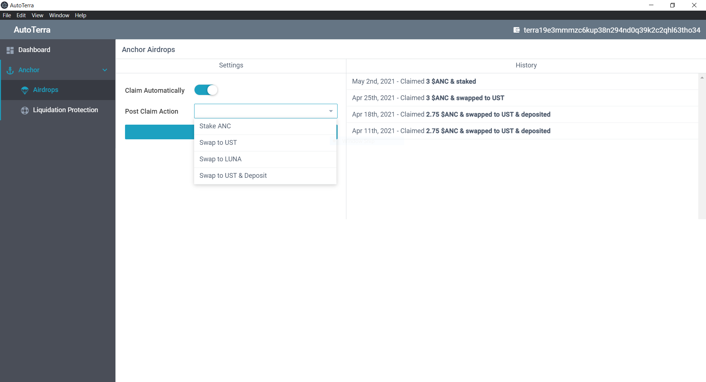
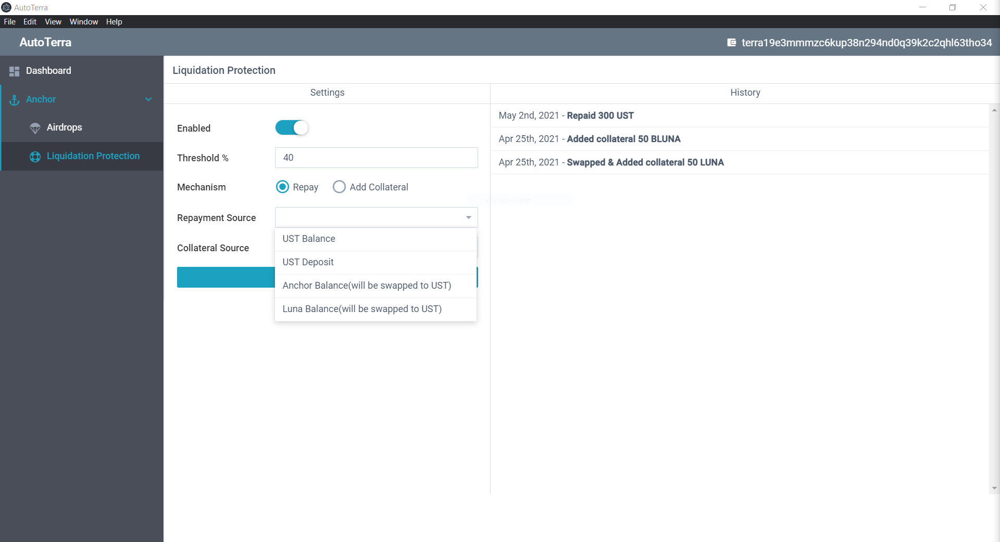

# About

AutoTerra is a cross platform desktop application that automates routinely performed operations on various protocols present in the Terra ecosystem. It aims to save time and money for LUNAtics.

Here are a few functionalities in the roadmap:

* Automate airdrop collections
* Monitor and prevent liquidation on Anchor
* Automate staking/restaking
* Automate compounding for LPs
* Combinations of the above
* ... and more to come

## Why a client side application?

AutoTerra deliberately chooses to be a client-side application and not a smart-contract application for the following reasons:

* To be more flexible with implementable functionality 
* To simplify audits/tests
* To reduce attack surface area(nothing is stored in centralized pools/contracts)
* Author's development experience is primarily on traditional applications

## Status

AutoTerra is currently a work in progress with the UI mockups complete for a few features.

## UI Screenshots

**Dashboard**

**Airdrops**

**Liquidation Protection**

